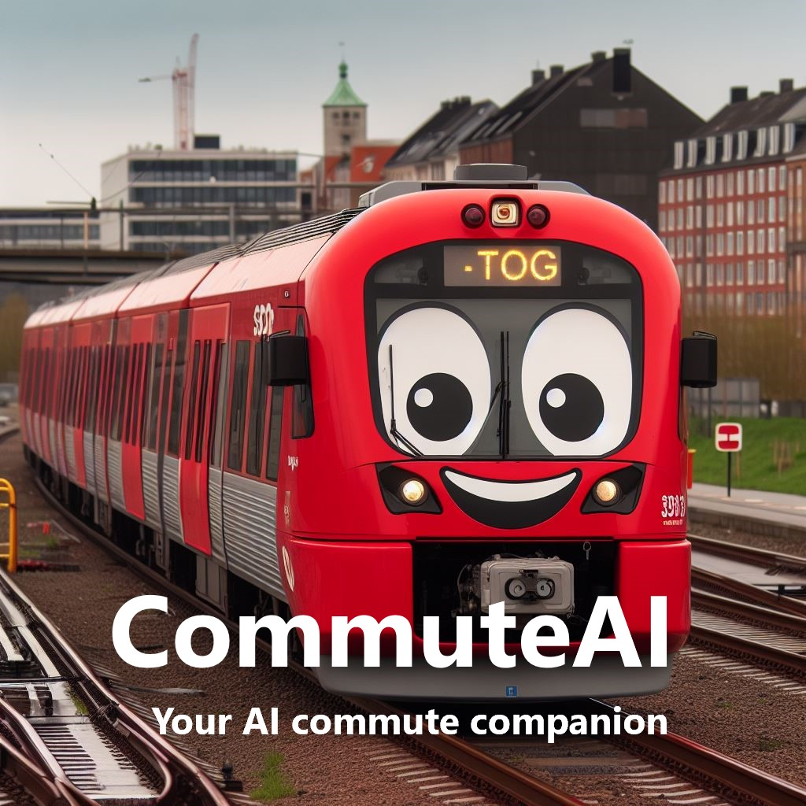
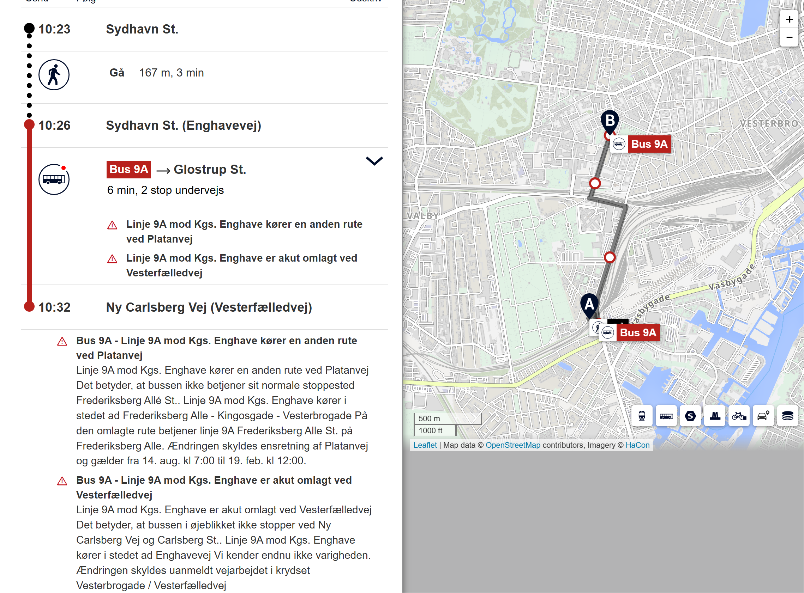
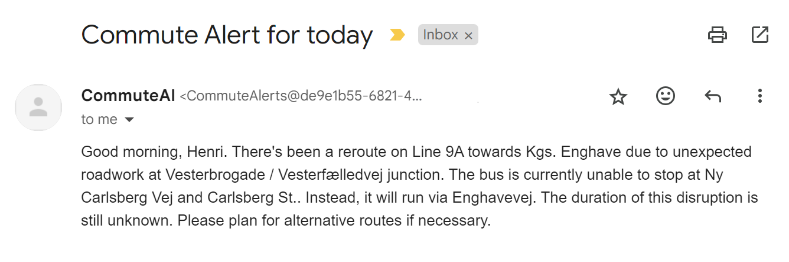

# CommuteAI - Your AI commute companion

CommuteAI is a small project for alerting Danish commuters about interruptions on their journeys. It's utilizing the Rejseplanen API as well as a number of Microsoft Azure services. You can deploy your own CommuteAI by following the setup steps below.

## How does it work?

CommuteAI runs as an Azure Function that is triggered by a timer every workday morning. The function then retrieves your current commute options from Rejseplanen, incl. any traffic alerts that may affect your journey. CommuteAI then utilizes GPT-4 in Azure AI to determine which alerts are relevant to your commute and write a summary. If there are relevant disruptions, you will receive the summary of relevant alerts as an email. 

Example of an (arguably short) commute by bus between Sydhavn St. and Ny Carlsberg Vej being suddenly impacted by roadwork:

## Setup instructions

You can deploy your own CommuteAI instance by following these steps:

1. [Register for Rejseplanen's free API](https://help.rejseplanen.dk/hc/en-us/articles/214174465-Rejseplanen-s-API).
1. Create the following Azure resources:
    - Azure AI (or Azure OpenAI)
    - Azure Function (Consumption Tier)
    - Azure Communication Service
    - Azure Email Communication Service
    - Azure Key Vault
    - Azure Storage Account

1. In Azure AI/OpenAI, create a new chat deployment (e.g., GPT-4).
1. In Azure Email Communication Service, create an email domain and connect it to your Azure Communication Service. You can follow the [quickstart for detailed instructions](https://learn.microsoft.com/en-us/azure/communication-services/quickstarts/email/create-email-communication-resource).
1. Clone this repo to your device and deploy the code to an Azure Function. You can follow the [quickstart for detailed instructions](https://learn.microsoft.com/en-us/azure/azure-functions/create-first-function-vs-code-python?pivots=python-mode-decorators).
1. Enable the system-assigned managed identity for your Azure Function.
1. Add the following two secrets to your Key Vault:
    - Key to your Azure AI/OpenAI service
    - Connection string for your Azure Communication Service
1. In Azure Key Vault, provide list and get permissions for secrets to your Azure Function.
1. [Configure the app settings](https://learn.microsoft.com/en-us/azure/azure-functions/functions-how-to-use-azure-function-app-settings?tabs=portal) of your Function. Add the settings shown in [this file](az-function-app-settings-example.json) and replace the placeholders with your values.

That's it! Tomorrow at 6:00 AM UTC, you will receive an email if something unexpected occurs on the route of your commute.
